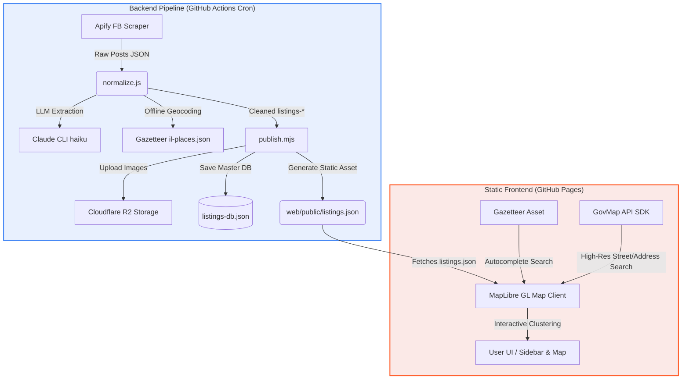
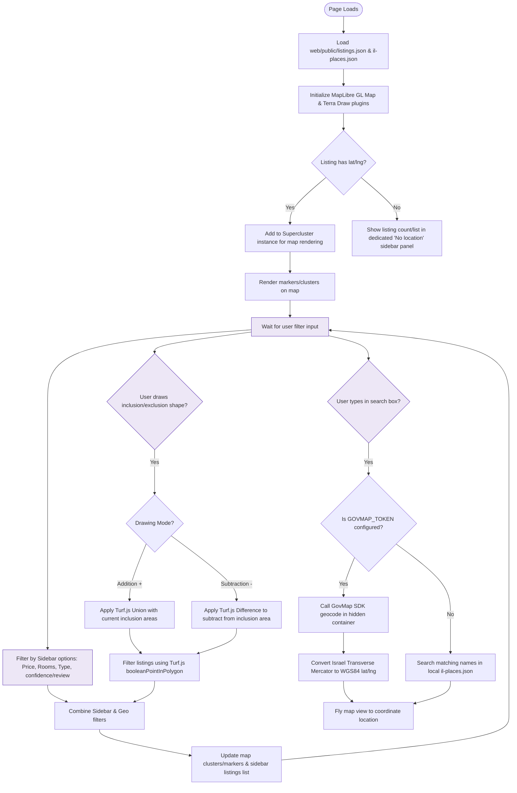

# Rentalify Flowchart & Project Logic

This document details the architecture and operational logic of the **Rentalify** project. Rentalify is split into two independent halves:
1. **The Ingestion & Processing Pipeline** (Node.js script run on a schedule or manually via GitHub Actions).
2. **The Frontend Map Application** (Vite + MapLibre GL hosted on GitHub Pages).

---

## 1. High-Level Architecture

The project maintains separation of concerns:
- **No live server or database connections from the frontend.**
- The frontend only reads a pre-compiled static JSON file (`listings.json`) served as an asset on GitHub Pages.
- A GitHub Actions cron job runs the processing pipeline to regenerate this JSON file periodically.

---

## 2. Ingestion & Processing Pipeline Logic (`normalize.js` & `publish.mjs`)

This flowchart details how Facebook rental posts are scraped, normalized, geocoded, cached, rehosted, and compiled.

```mermaid
flowchart TD
    Start(["1. Start Pipeline Run"]) --> LoadState["Load state.json & LLM extract-cache.json"]

    %% Watermark calculation
    LoadState --> CalcWindow{"First run (no watermark)?"}
    CalcWindow -->|Yes| Backfill["Set window start to FRESH_LOOKBACK_DAYS ago (7d)"]
    CalcWindow -->|No| Incremental["Set window start to last_posted_at - OVERLAP_DAYS (2d)"]

    %% Scrape stage
    Backfill --> CheckApifyReuse{"Does Apify have a recent SUCCEEDED run covering window?"}
    Incremental --> CheckApifyReuse
    CheckApifyReuse -->|Yes| ReuseDataset["Download items from existing default dataset for free"]
    CheckApifyReuse -->|No| RunScraper["Trigger Apify Actor 2chN8UQcH1CfxLRNE to scrape FB group"]

    %% Pre-filtering and LLM mapping
    ReuseDataset --> ReadItems["Parse items to raw objects"]
    RunScraper --> ReadItems
    ReadItems --> LoopItems["Loop through fetched items"]
    LoopItems --> HebrewCheck{"Contains Hebrew text?"}
    HebrewCheck -->|No| SkipDrop["Drop & increment non_rental_filtered_out"]
    HebrewCheck -->|Yes| SeenCheck{"Post ID already in seen_post_ids?"}
    SeenCheck -->|Yes| SkipDup["Drop & increment duplicates_skipped"]
    
    %% AI Extraction
    SeenCheck -->|No| CacheCheck{"Post ID in extract-cache.json?"}
    CacheCheck -->|Yes| ReadCache["Retrieve extracted JSON from cache"]
    CacheCheck -->|No| ShellClaude["Execute claude -p with extraction-prompt.md using haiku"]
    ShellClaude --> CacheSave["Save JSON result to out/extract-cache.json"]
    
    %% Post-processing
    ReadCache --> Normalize["Normalize fields & clamp enums/numbers to Schema"]
    CacheSave --> Normalize
    
    Normalize --> Geocode["Offline Geocode using geo/il-places.json"]
    Geocode --> ValidCheck{"Does output validate against rental-listings.schema.json?"}
    ValidCheck -->|Yes| KeepListing["Add to listings list & mark Post ID as seen"]
    ValidCheck -->|No/Failure| RetryNext["Skip Post ID, do not mark as seen - will retry next run"]

    %% Accumulate/Publish
    KeepListing --> EndGroup["Loop ends: Update state.json & save out/listings-*.json"]
    EndGroup --> PublishStep["Start publish.mjs"]
    PublishStep --> LoadDB["Load Master listings-db.json"]
    LoadDB --> MergeNew["Merge new listings into DB"]
    MergeNew --> R2Check{"Cloudflare R2 credentials configured?"}
    R2Check -->|Yes| RehostImages["Download FB images, upload to R2, replace image URLs"]
    R2Check -->|No| KeepFBUrls["Retain original Facebook image URLs"]
    
    RehostImages --> PruneOld["Delete listings older than MAX_AGE_MONTHS & delete images from R2"]
    KeepFBUrls --> PruneOld
    
    PruneOld --> SaveDB["Write updated listings-db.json"]
    SaveDB --> OutputJSON["Generate web/public/listings.json & web/public/il-places.json"]
    OutputJSON --> End(["End Pipeline Run"])

    classDef stage fill:#f1f8e9,stroke:#558b2f,stroke-width:1px;
    class LoadState,ReadItems,Normalize,Geocode stage;
```

---

## 3. Frontend Interactive Filtering Map Logic (`web/`)

This flowchart details how the frontend client displays data and processes geospatial filter queries.

